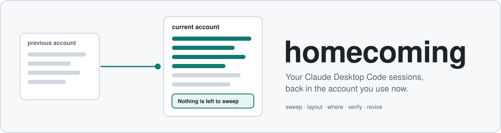

<p align="center">
  
</p>

# homecoming

Bring Claude Desktop **Code** sessions from a previous local account back into the sidebar of the
account you are signed into now, without moving or modifying the originals.

> **Not affiliated with, endorsed by, or supported by Anthropic.** "Claude" and "Claude Desktop" are
> Anthropic's names; this is an independent tool that reads and writes files the desktop app keeps
> on your own disk.

## Why

Claude Desktop files each Code session under the folder of the account you were signed into. There
is no account field inside the session, only the folder. Sign into a different account and the
sidebar starts empty: every conversation is still on disk, intact, and invisible. The transcripts
themselves are account-agnostic; only a small card has to exist in the right folder.
[How it works](docs/guide/how-it-works.md).

## What it does

- **`sweep`** copies your sessions from the previous account into this one, archived included,
  brings back conversations the app deleted that nothing points at, gives each branch of a forked
  conversation its own row, and re-scans until it can say "Nothing is left to sweep".
- **`return`** removes the copies again. The originals are never touched: fostering only adds files.
- **`layout`**, **`pin`** and **`view`** bring sidebar groups, routines, pins and the filter menu along.
- **`where`**, **`verify`**, **`grep`**, **`export`**, **`revive`**, **`rescue`**, **`disk`** and
  **`stats`** answer the questions that come after: which row to continue in, whether a restart
  undid anything, what was said where, which sessions a restart cut off.

34 commands in all (`homecoming --help`), and a guided menu when run with no arguments. The
commands that change sessions, the sidebar or the app's settings are dry runs until you pass
`--yes`, and the guided menu asks before it writes. A few act as soon as they run, because acting
is the whole request: `label` records an account's name in the ledger, `resume` sends one prompt
into an existing conversation through `claude -p --resume`, `cache clear` deletes the rebuildable
scan cache, `export --out` writes the file you name, `rescue --open` opens a terminal tab per
conversation with the resume already running, and `app quit`, `app start` and `app restart`
do what they say.

## Install

Windows, Node.js 20 or newer:

```powershell
irm https://github.com/shipsfromrio/homecoming/releases/latest/download/install.ps1 | iex
```

The installer pins the release tag it was published from and verifies the single-file bundle
(`homecoming.js`, about 850 KB) against the release's SHA256 before writing anything.

## Quick start

```bash
homecoming doctor            # which store, which account, is the app running
homecoming sweep             # dry run: what would come in
homecoming sweep --yes --restart
```

Changes appear after Claude Desktop restarts: the sidebar is built at startup.

## Safety

- The originals are never modified. Every completed write is recorded in an append-only ledger
  (`~/.foster/ledger.jsonl`, or under `FOSTER_HOME`), which is what every undo reads.
- Removing a copy refuses while a running app holds it, because the app would write it back.
- `purge` is the one command that destroys data. It needs `--confirm <count>` as well as `--yes`.
- No credential is extracted, kept, logged, used or sent, no cookie store is opened, and no one is
  signed in or out. To learn which account is signed in, homecoming reads the account id and a few
  plain settings from the app's `config.json`. That file also holds the app's cached sign-in token;
  the core does not read it, and never its value. Whether a token entry is present is left to a
  plugin (`credentialProbes`). The only network request is a daily release check;
  `FOSTER_NO_UPDATE_CHECK=1` turns it off.

The long form is in the [safety model](docs/guide/safety-model.md) and the [guide](docs/guide/README.md).

## Extending it

The CLI is also a library. A plugin adds commands, options and hooks on the core's commands, ledger
state of its own, stores, account names and identity, sweep phases, doctor checks, menu entries,
report dimensions, preference allowlists and more, without touching the core's files. With no
plugin registered, every one of these points does nothing, and the core behaves as documented
above:

```ts
import { definePlugin, runCli } from 'homecoming';

const hello = definePlugin({
  name: 'hello',
  register(program, { print }) {
    program.command('hello').action(() => print({ hello: 'world' }));
  },
  doctorChecks: [{ name: 'Hello', run: () => [{ level: 'ok', message: 'plugin loaded' }] }],
});

await runCli({ plugins: [hello] });
```

Every field of a plugin is optional, and each one is also a standalone `register*` function that
returns an unregister function, for use outside `runCli`:

| Plugin field                 | Standalone                          | What the core does with it                                                                                                                                                                                |
| ---------------------------- | ----------------------------------- | --------------------------------------------------------------------------------------------------------------------------------------------------------------------------------------------------------- |
| `register(program, context)` | none                                | adds commands, options or hooks to the CLI; `context` resolves the store and ledger a command acts on and prints JSON the way `--json` does                                                               |
| `ledgerReducers`             | `registerLedgerReducer`             | folds the plugin's own event kinds into a state slot of its own (`ledgerSlots`, `projectSlot`); events are written with `Ledger.appendRecord`, and core kinds are refused                                 |
| `storeProviders`             | `registerStoreProvider`             | further installations that `--store`, `stores` and `where` know about; an entry's `hint` is printed beside it in `stores`, and its `remedy` is added to the error when its directory is gone              |
| `storeRootCandidates`        | `registerStoreRootCandidates`       | further directories to consider as the default store, each with a priority; the core's own sit at 100, and a candidate with no sessions directory is skipped                                              |
| `storeArgResolvers`          | `registerStoreArgResolver`          | further meanings for `--store <arg>`, asked after a path, a store name and an account and before the path-piece match; every earlier meaning still wins                                                   |
| `configDirProviders`         | `registerConfigDirProvider`         | further CLI config directories to read transcripts and live sessions from; a provider gets the command's ledger as a third argument                                                                       |
| `accountNamers`              | `registerAccountNamer`              | names for accounts nobody labelled                                                                                                                                                                        |
| `identityReaders`            | `registerIdentityReader`            | more about an account, read at rest, for the fields the app's cache left empty; never overwrites what the core read                                                                                       |
| `identitySources`            | `registerIdentitySource`            | an earlier, dated sighting of an account, used by `whoami` and `label --from-cache` for what the cache no longer holds (`remembered`, `seenAt`); the core remembers nothing                               |
| `identityObservers`          | `registerIdentityObserver`          | told whenever a fresh read found something about an account; one that throws is ignored                                                                                                                   |
| `accountDecorators`          | `registerAccountDecorator`          | a marker, meta and detail lines for an account on the home screen, the dashboard and the account details                                                                                                  |
| `sweepPhases`                | `registerSweepPhase`                | passes that run after the core sweep passes, on the dry run and after a `--yes` run's writes; `interactiveOptions` is what the menu's sweep passes them                                                   |
| `doctorChecks`               | `registerDoctorCheck`               | more findings in `doctor`, each with optional `data`; `json` adds top-level keys to `doctor --json`, and a key the core owns is refused and reported; a check that throws is reported as an error finding |
| `menuItems`                  | `registerMenuItem`                  | entries in the interactive menu, with optional `aliases`; `run` may hand back a store or account for the next screens to act on                                                                           |
| `accountMenuItems`           | `registerAccountMenuItem`           | entries in the menu an account row opens, offered when `when` says so; one that reuses a core verb is ignored                                                                                             |
| `commandExtenders`           | `registerCommandExtender`           | options and `before`/`after` hooks on a core command; a `before` that returns `true` runs instead of the core action, and naming a command that does not exist fails the run                              |
| `nextStepHints`              | `registerNextStepHint`              | a dim line suggesting what to run next, printed after a core command and never on a `--json` run                                                                                                          |
| `statsDimensions`            | `registerStatsDimension`            | further values `stats --by` accepts, each grouping by a key it gives per record; the core accepts `model` and `week`                                                                                      |
| `statsCounters`              | `registerStatsCounter`              | more things `stats` counts on each record, summed per group and in the total                                                                                                                              |
| `reviveInclusions`           | `registerReviveInclusion`           | fostered copies `revive` may list; the core lists none, because a copy's stop belongs to the account the conversation ran in                                                                              |
| `unstartedSources`           | `registerUnstartedSource`           | further places `unstarted` looks for lost requests; the core looks only in the account signed in                                                                                                          |
| `importUndoProviders`        | `registerImportUndoProvider`        | further things `return` lists and takes back, under the same `--yes`; the core returns only fostered copies                                                                                               |
| `appPrefAllowlists`          | `registerAppPrefAllowlist`          | guarded preference names this plugin may write; the core refuses organization policy, compliance and approval preferences                                                                                 |
| `appPrefWriteNotices`        | `registerAppPrefWriteNotice`        | a line `app pref` prints after a write                                                                                                                                                                    |
| `accountPrefCarryAllowlists` | `registerAccountPrefCarryAllowlist` | per-account preferences `layout` may carry to the target account; the core carries its own list and refuses the rest                                                                                      |
| `layoutStorageWrites`        | `registerLayoutStorageWrite`        | further Local Storage entries `layout` writes, in the same batch and the same backup as its own; one that fails aborts the batch                                                                          |
| `credentialProbes`           | `registerCredentialProbe`           | whether a store's config carries a sign-in token, presence only; the core never looks, and a probe must not return the token                                                                              |
| `updateChannel`              | `registerUpdateChannel`             | where the release check looks and the command it suggests; one per process, and a second is refused                                                                                                       |
| `themeSlots`                 | `registerThemeSlot`                 | further named colours per theme, read with `themeColor`; `paintFg`, `meter`, `Theme` and `ColorLevel` are exported for drawing with them                                                                  |
| `agentTools`                 | `registerAgentTool`                 | tools a host that embeds homecoming may offer to an agent (`listAgentTools`); the core runs no agent                                                                                                      |

Everything else under `src/` is internal and may change between minor versions.

homecoming is not published to npm, so `npm install homecoming` does not work. Each release
attaches the package as a tarball; install that into the project that holds your plugin, and the
import above resolves:

```bash
npm install https://github.com/shipsfromrio/homecoming/releases/download/v1.0.0/homecoming-1.0.0.tgz
```

Or build it from a git checkout of the tag you want: `npm ci && npm run build && npm pack`, then
`npm install` the `.tgz` it writes. Type declarations ship in `dist/lib`. The contract is pinned by
`tests/plugin.test.ts`: every extension point is consulted and let go again, a plugin that fails
to register is reported and exits 1, and its sweep phases run through the `homecoming sweep`
command, on the dry run and after a `--yes` run's writes. `tests/interactive.test.ts` pins that
they run in the menu's sweep too. A phase's `lines` are only printed; the menu reads "Nothing to
sweep" and whether to offer a restart from the `pending` and `changed` counts a phase returns.

## Development

```bash
npm ci
npm run check    # typecheck, lint, format, privacy guard, tests with the coverage floor
npm run build    # dist/homecoming.js (the CLI) and dist/lib (the plugin API)
```

Measured on this tree: 1,932 tests in 100 files, all against synthetic stores in temporary
directories (the test setup isolates the home directory, `APPDATA`, `LOCALAPPDATA`,
`CLAUDE_CONFIG_DIR` and `FOSTER_HOME`, and a test fails if any leaks through); line coverage 73.5%
over about 41,000 lines of TypeScript. CI runs on Windows and Ubuntu, Node 22 and 24.
[Development and releasing](docs/guide/development.md).

homecoming was extracted from a private tool of the author's; its development history is not
included in this repository.

## License

[MIT](LICENSE)
